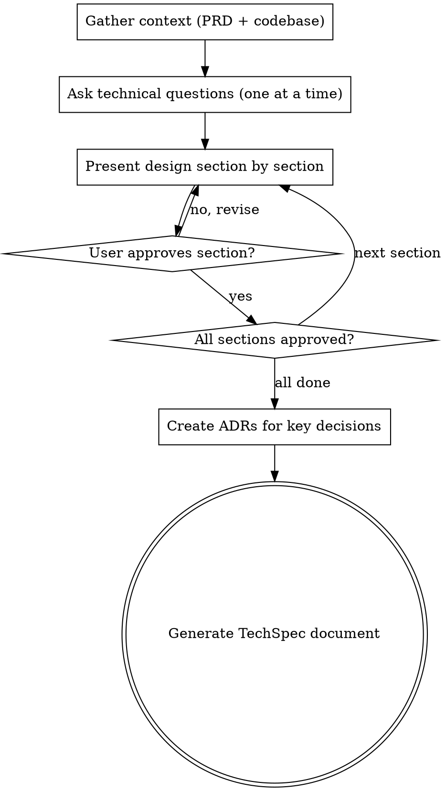

# Create TechSpec

Translate business requirements into a detailed technical specification.

<HARD-GATE>
Do NOT generate the TechSpec document, write any file, or take any implementation action until you have presented the technical design section by section and the user has approved each section. This applies to EVERY TechSpec regardless of perceived simplicity.
</HARD-GATE>

## Asking Questions

When this skill instructs you to ask the user a question, you MUST use your runtime's dedicated interactive question tool — the tool or function that presents a question to the user and **pauses execution until the user responds**. Do not output questions as plain assistant text and continue generating; always use the mechanism that blocks until the user has answered.

If your runtime does not provide such a tool, present the question as your complete message and stop generating. Do not answer your own question or proceed without user input.

## Anti-Pattern: "This Is Too Simple To Need Technical Design Review"

Every TechSpec goes through the full design review process. A single endpoint, a minor refactor, a configuration change — all of them. "Simple" technical changes are where unexamined assumptions about existing architecture cause the most integration failures. The design review can be brief for genuinely simple changes, but you MUST present it and get approval.

## Required Inputs

- Feature name identifying the `.compozy/tasks/<name>/` directory.
- Optional: existing `_prd.md` as primary input.
- Optional: existing `_techspec.md` for update mode.

## Workflow

1. Gather context.
   - Check for `_prd.md` in `.compozy/tasks/<name>/`. If it exists, read it as the primary input.
   - If no PRD exists, ask the user for a description of what needs technical specification.
   - Read existing ADRs from `.compozy/tasks/<name>/adrs/` to understand decisions already made during PRD creation.
   - Create `.compozy/tasks/<name>/adrs/` directory if it does not exist.
   - Spawn an Agent tool call to explore the codebase for architecture patterns, existing components, dependencies, and technology stack.
   - If `_techspec.md` already exists, read it and operate in update mode.

2. Ask technical clarification questions.
   - Focus on HOW to implement, WHERE components live, and WHICH technologies to use.
   - Cover architecture approach and component boundaries.
   - Cover data models and storage choices.
   - Cover API design and integration points.
   - Cover testing strategy and performance requirements.
   - Ask only one question per message. If a topic needs more exploration, break it into a sequence of individual questions.
   - Prefer multiple-choice questions when the options can be predetermined.

3. Present the technical design incrementally for approval.
   - Present the design section by section, scaled to each section's complexity: a few sentences if straightforward, up to 200-300 words if nuanced.
   - Present one section at a time and ask the user whether it looks right before moving to the next.
   - Sections to cover: System Architecture, Core Interfaces, Data Models, API Design, Integration Points, Testing Approach, Development Sequencing.
   - Be ready to revise any section based on feedback before proceeding.
   - Apply YAGNI ruthlessly: remove any component, interface, or abstraction that is not strictly necessary.
   - If the user requests changes to a section, revise and re-present that section.
   - After all sections are approved, create an ADR for each significant technical decision (architecture pattern chosen, technology selected, data model approach, etc.):
     - Read `references/adr-template.md`.
     - Determine the next ADR number by listing existing files in `.compozy/tasks/<name>/adrs/`.
     - Fill the template: the chosen design as "Decision", rejected alternatives as "Alternatives Considered", and trade-offs as "Consequences". Set Status to "Accepted" and Date to today.
     - Write each ADR to `.compozy/tasks/<name>/adrs/adr-NNN.md` (zero-padded 3-digit sequential number).

4. Generate the TechSpec document.
   - Read `references/techspec-template.md` and fill every applicable section.
   - Include an "Architecture Decision Records" section listing all ADRs (from both PRD brainstorming and technical design) with their numbers, titles, and one-line summaries as links to the `adrs/` directory.
   - Write the completed document to `.compozy/tasks/<name>/_techspec.md`.
   - Every PRD goal and user story should map to a technical component.
   - Reference PRD sections by name but do not duplicate business context.
   - Include code examples only for core interfaces, limited to 20 lines each.

## Process Flow

## Error Handling

- If the PRD is missing, proceed with user-provided context and note the absence in the Executive Summary.
- If codebase exploration reveals conflicting architectural patterns, document both and recommend one with rationale.
- If the user rejects the design proposal, incorporate all feedback and present a revised proposal.
- If the target directory does not exist, create it.
- If operating in update mode, preserve sections the user has not asked to change.

## Key Principles

- **One question at a time** — Do not overwhelm with multiple questions in a single message
- **Multiple choice preferred** — Easier for users to answer than open-ended when possible
- **YAGNI ruthlessly** — Remove unnecessary components, abstractions, and interfaces from all designs
- **Incremental validation** — Present design section by section, get approval before moving on
- **Technical focus only** — Never ask business questions; that belongs in the PRD
